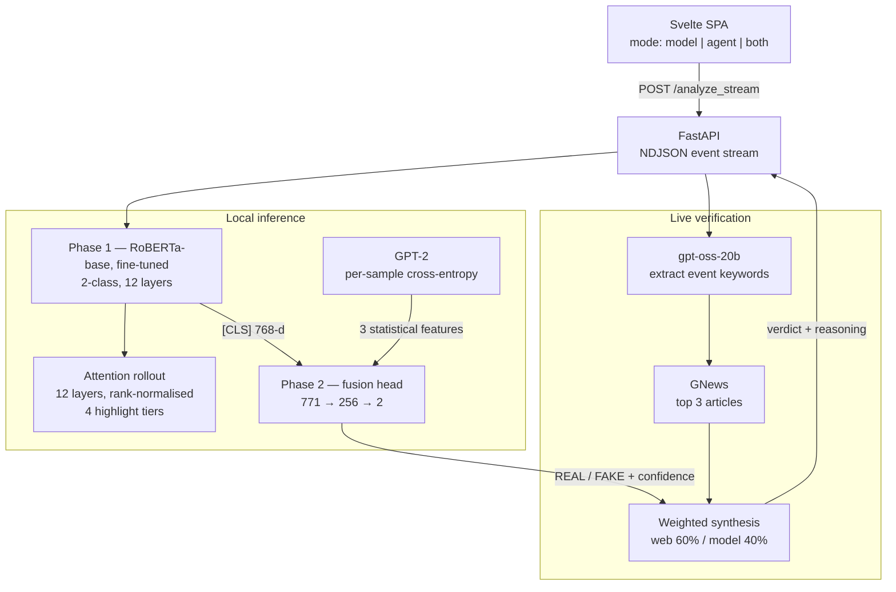

# Truth Shield

Fake news detection combining a fine-tuned RoBERTa classifier with an LLM agent
that verifies claims against live news coverage.

**Live: https://dhruvv1402--truth-shield-truthshield-web.modal.run**

A claim is scored two ways. A transformer trained on labelled news judges it on
linguistic structure alone; an agent extracts the underlying event, searches
current reporting, and weighs what it finds against the model's opinion. The two
disagree often, and which one wins is the interesting part — structural analysis
cannot know whether something happened, and live search cannot tell a careless
report from a fabricated one.

Every verdict is explained: attention rollout across all twelve encoder layers
marks which spans of the input drove the score.

---

## Architecture



The whole thing is one container. FastAPI serves the compiled Svelte bundle and
the API from the same origin, so there is no CORS surface and one URL is the
entire product.

## How a verdict is produced

**Phase 1** is RoBERTa-base fully fine-tuned for binary classification. Used
alone it is the fastest path and the only one that works with no API keys.

**Phase 2** takes the phase-1 `[CLS]` embedding (768-d) and concatenates three
hand-built statistical features — GPT-2 per-sample cross-entropy, sentence-length
variance, and the negated cross-entropy — then passes the 771-d vector through a
fusion head. The features are normalised with the training-set mean and standard
deviation stored in the checkpoint, not against the sample itself. Best
validation F1 was **0.9956**.

**The agent** extracts two to four keywords naming the underlying event, queries
GNews for current coverage, and synthesises a verdict weighting live evidence at
60% and the model at 40%. Contradicting coverage overrides a confident
classification, which matters because the classifier's training data predates
recent events.

**Explainability** comes from attention rollout: the twelve layers' averaged
attention matrices are composed, the first-token row is taken as per-token
importance, rank-normalised, and bucketed into four highlight tiers.

## API

| Endpoint | Purpose |
|---|---|
| `POST /analyze` | Synchronous. Returns label, class probabilities, tokens with highlight tiers. |
| `POST /analyze_stream` | Newline-delimited JSON stream of `status`, `verdict`, `token`, `llm_chunk` events. |
| `GET /health` | Device, whether the fusion head loaded, and which capabilities are configured. |

```json
{ "text": "...", "model": "phase2", "agent_mode": "both" }
```

`model` is `phase1` or `phase2`. `agent_mode` is `model`, `agent`, or `both`.

The agent leg is contained: if the upstream LLM is slow or unavailable, the
request degrades to local scoring and says so in the stream rather than dropping
a half-written response.

## Measured performance

Resident memory, 512-token input, CPU, fp32:

| Stage | RSS |
|---|---|
| torch imported | 182 MB |
| both checkpoints and GPT-2 loaded | 411 MB |
| after `/analyze` phase 1 | 846 MB |
| after `/analyze` phase 2 | 1626 MB |

Against the deployed instance:

| | |
|---|---|
| `agent_mode=model` | 2.7 s |
| `agent_mode=both` | 14.4 s |
| Cold start | 13-22 s |
| Warm `/health` | 0.9 s |

The 1.6 GB peak is the binding constraint on hosting: it rules out every 512 MB
free tier.

## Running locally

```bash
cd backend
python -m venv .venv && .venv/Scripts/activate    # source .venv/bin/activate on Unix
pip install -r requirements.txt
python download_models.py                          # ~460 MB of weights
cp .env.example .env                               # add the two API keys
uvicorn main:app --reload --port 8000
```

```bash
cd frontend && npm install && npm run dev          # proxies /analyze* to :8000
```

Weights are too large for the git tree and ship as release assets.
`download_models.py` fetches and unpacks them into `backend/models/`; point it
elsewhere with `MODEL_RELEASE_REPO` and `MODEL_RELEASE_TAG`.

## Deployment

Modal, which scales to zero between visitors:

```bash
cd frontend && npm ci && npm run build && cd ..
modal secret create truth-shield-keys NVIDIA_API_KEY=... GNEWS_API_KEY=...
modal deploy modal_app.py
```

Or as a container on any Docker host — the image reads `$PORT`:

```bash
docker build -t truthshield .
docker run --rm -p 7860:7860 -e NVIDIA_API_KEY=... -e GNEWS_API_KEY=... truthshield
```

See [DEPLOYMENT.md](DEPLOYMENT.md) for hosting comparisons, cost, and tuning.

## Configuration

| Variable | Default | Purpose |
|---|---|---|
| `NVIDIA_API_KEY` | — | Agent modes. Absent, the API degrades to local scoring. |
| `GNEWS_API_KEY` | — | Live verification. Absent, the agent reasons without web evidence. |
| `AGENT_MODEL` | `openai/gpt-oss-20b` | NVIDIA-hosted model. Hosted models get retired; this is why it is configurable. |
| `MODELS_DIR` | `backend/models` | Checkpoint location. |
| `FRONTEND_DIST` | `backend/frontend_dist` | Built SPA. Absent, the service runs API-only. |
| `ALLOWED_ORIGINS` | `*` | Comma-separated CORS allowlist. |
| `PORT` | `7860` | Listen port. |

## Layout

```
backend/            FastAPI service, model loading, inference, agent pipeline
frontend/           Svelte 5 + Vite single-page app
modal_app.py        Modal deployment: image definition and ASGI entrypoint
Dockerfile          Multi-stage build, CPU-only torch
Model_desgin_v1..3  Training history; v3 produced the deployed checkpoints
report_ppts/        Figures and written report
```

## License

Apache 2.0. Datasets sourced from Kaggle and other third parties remain under
their own terms.
